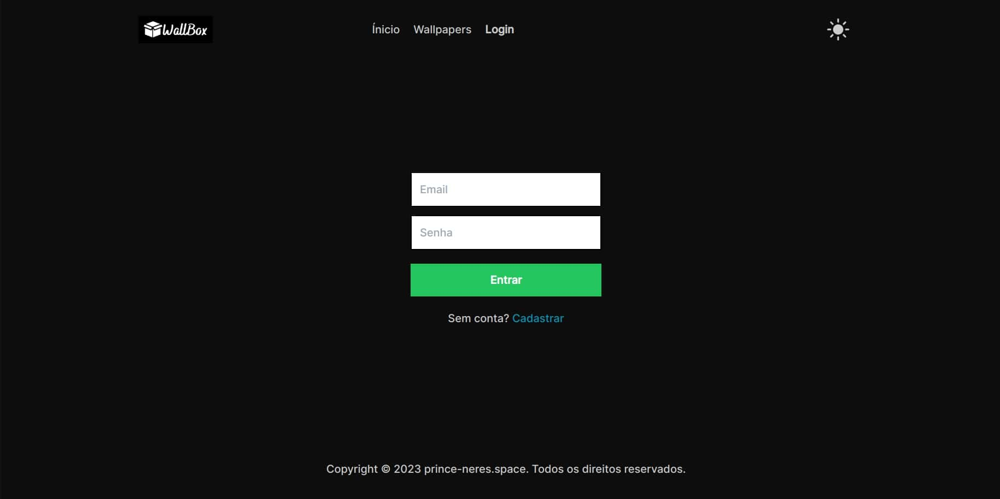
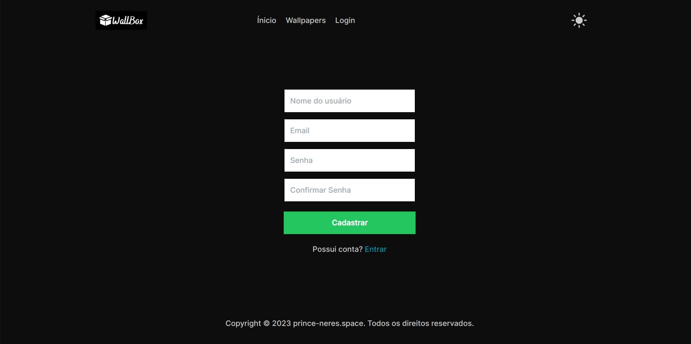
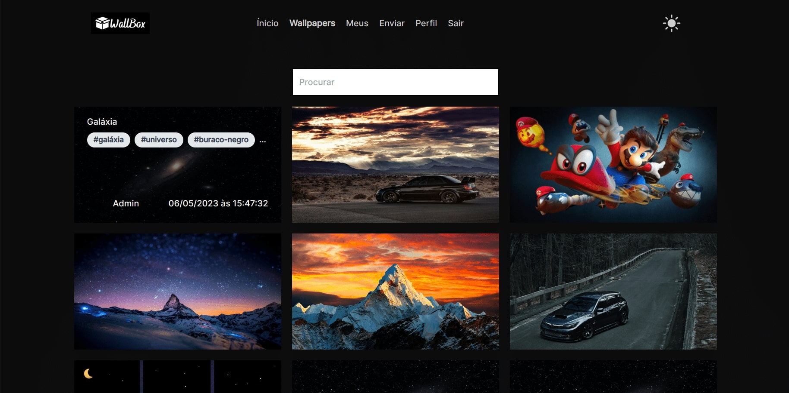
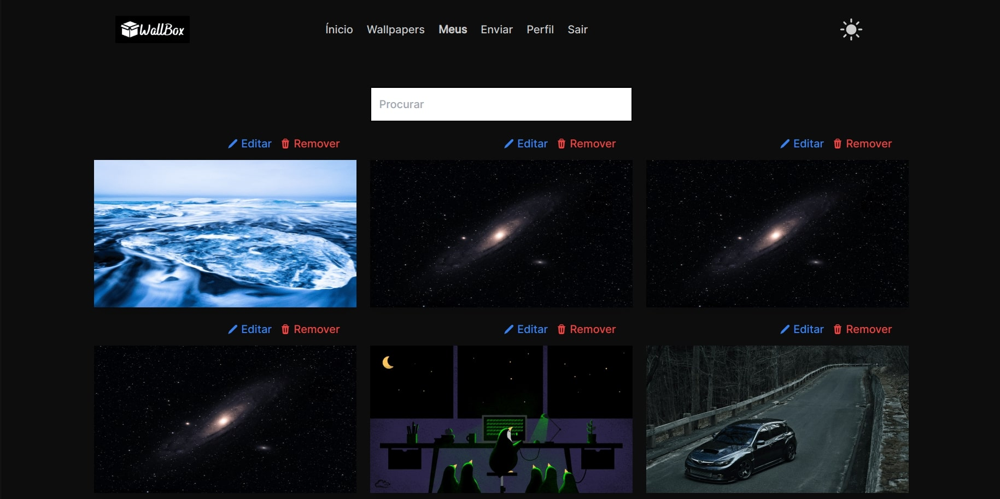
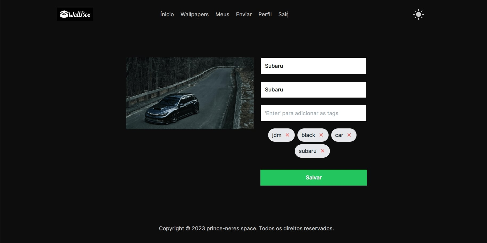
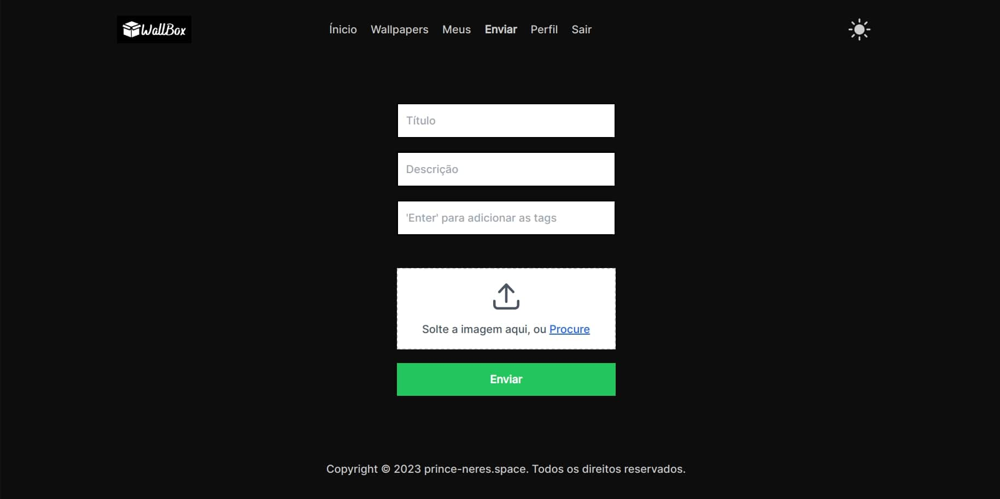
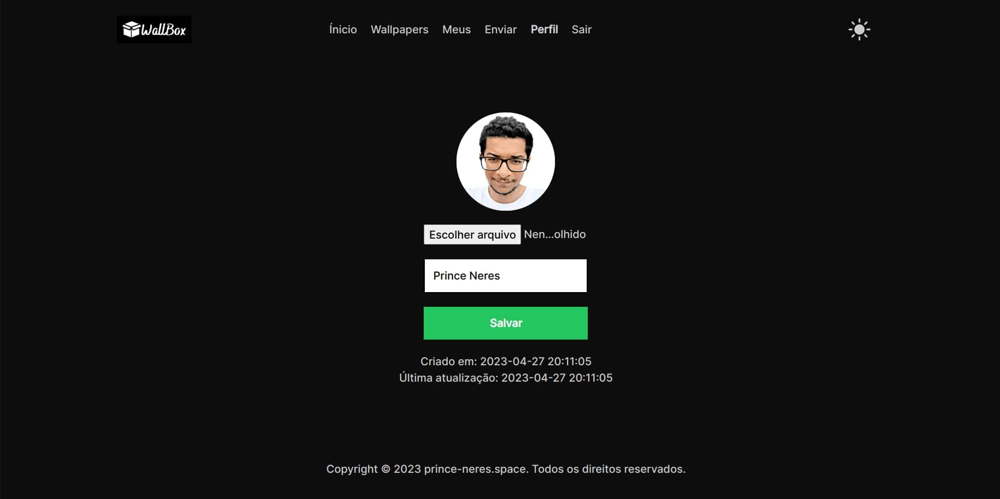

# Aplicação de Wallpapers WallBox

Projeto feito como meio para práticar habilidades.

## Como rodar frontend passo a passo:

1. Necessário rodar banckend antes, repositório: `git clone https://github.com/prince-neres/wallbox-api.git`
2. Clone o projeto com `git clone https://github.com/prince-neres/wallbox-web.git`
3. Entre no diretório do projeto com cd `wallbox-web `
4. Execute o comando `yarn` ou `npm -i`
5. Execute o comando `yarn dev` ou `npm run dev`

### Previews

	<h3>Login</h3>
	

	<h3>Cadastro</h3>
	

	<h3>Wallpapers</h3>
	

	<h3>Wallpapers do usuário</h3>
	

	<h3>Edição de wallpaper</h3>
	

	<h3>Upload de wallpaper</h3>
	

	<h3>Edição de usuário</h3>
	

